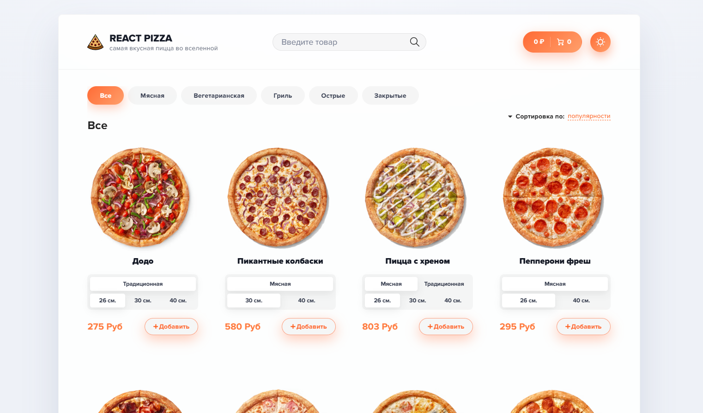
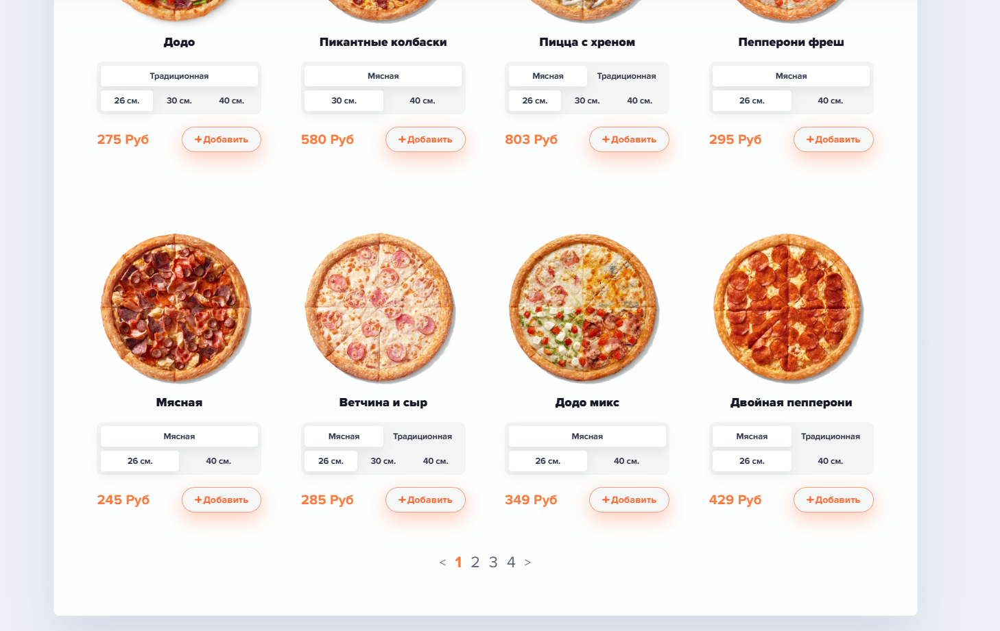
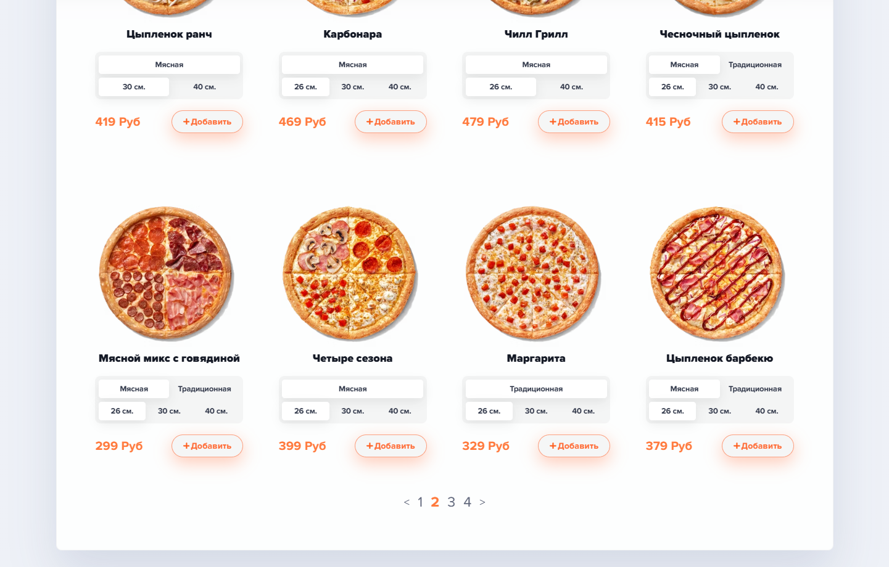
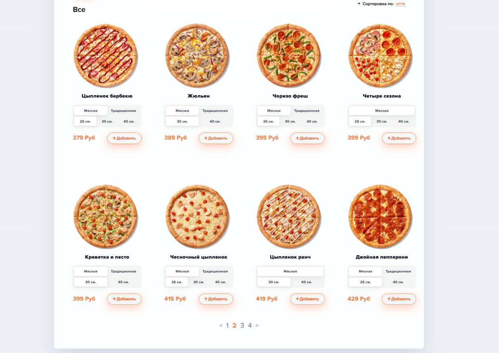
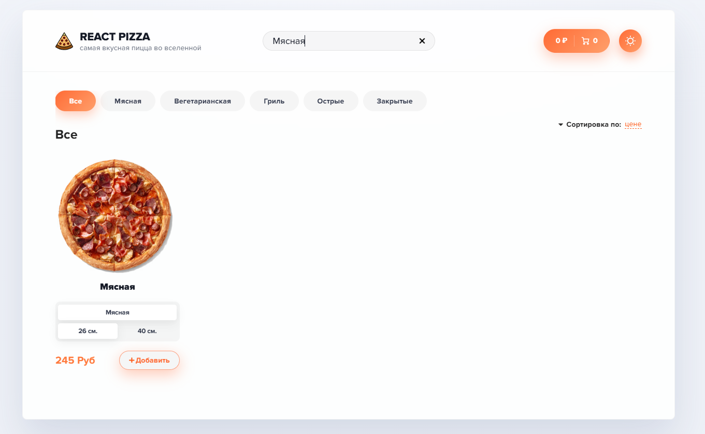
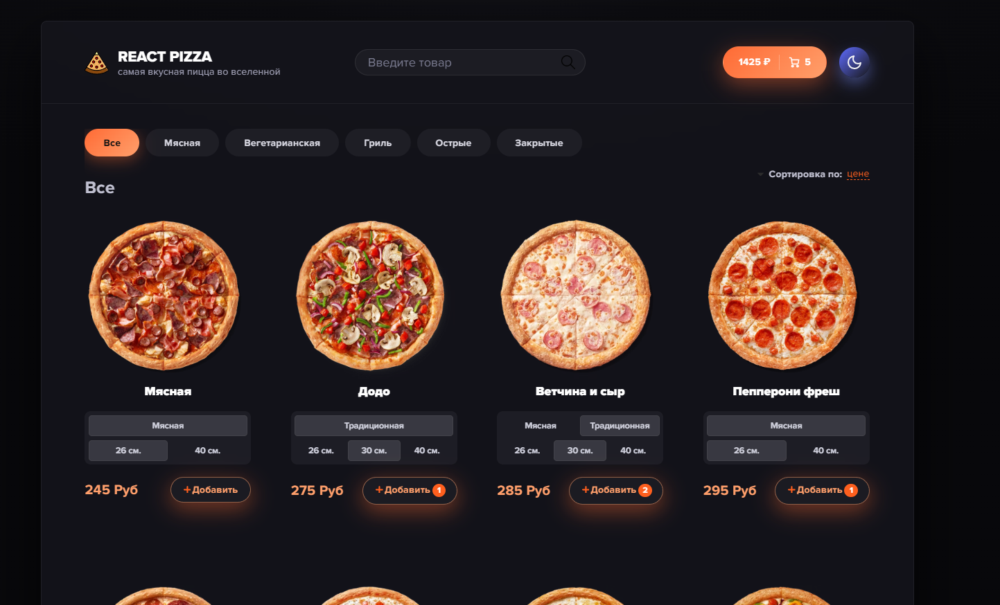
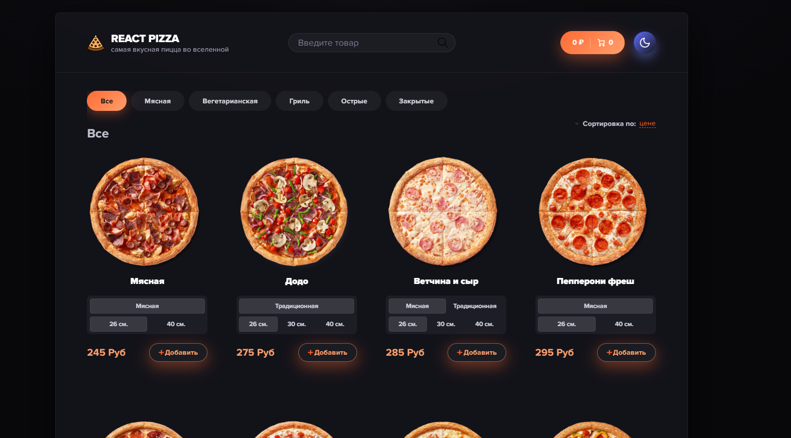
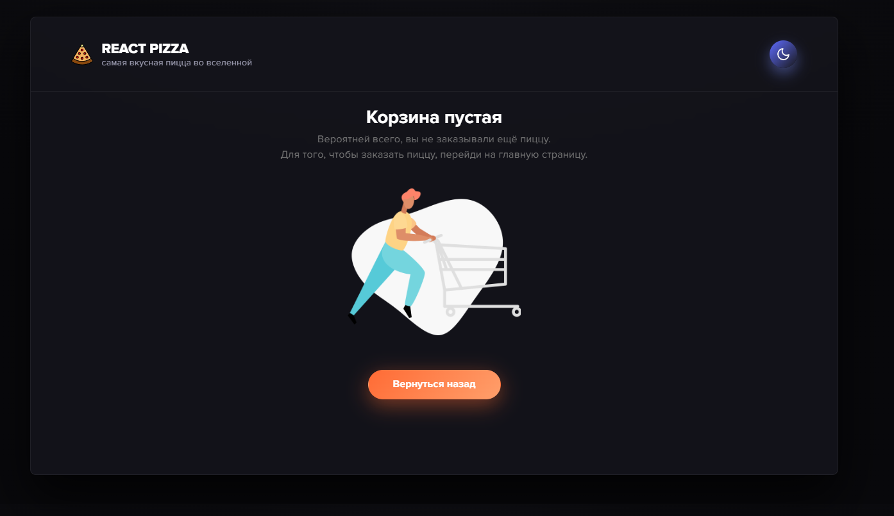
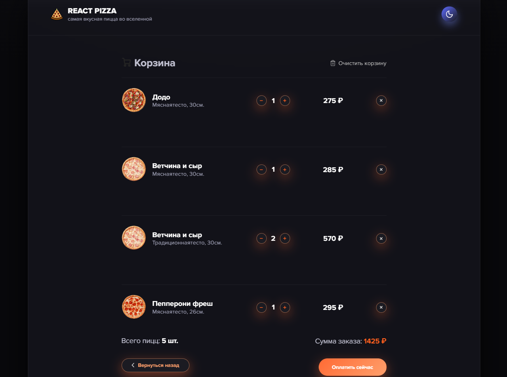

# React__Pizza-V2 (Redux Toolkit)🍕


## 💥 О проекте
React Pizza V2 — представляет собой полную переработку проекта с переходом на современный стек: Redux Toolkit, TypeScript строгой типизации,  функциональные компоненты с хуками и т.д. Этот проект показывает развитие от классических подходов к современным best practices.

## ❓ В чем разница?
`Было:` Классовые компоненты - `Стало:` Функциональные компоненты с хуками

`Было:` Ручной Redux - `Стало:` Redux Toolkit с автоматической типизацией


`Было:` Простая загрузка - `Стало:` Продвинутый UX со скелетонами

`Было:` Базовый TypeScript - `Стало:` Строгая полная типизация

`Было:` Поиск товаров и фильтрация через select - `Стало:` Поиск и фильтрация через API + `lodash.debounce` для оптимизации 

<i>`И многое другое❕` 


## 🛠 Полный стек технологий

### Frontend:

- React 

- TypeScript 

- Redux Toolkit

- React Router

- React Paginate 
 
- React Skeleton

- Axios


### Backend:

- json-server

## 📁 Строение папок проекта

```
React__Pizza V2
├─ eslint.config.js
├─ index.html
├─ package-lock.json
├─ package.json
├─ public
├─ server
│  └─ db.json
├─ src
│  ├─ App.tsx
│  ├─ assets
│  │  ├─ btn__tema-black.svg
│  │  ├─ btn__tema-white.svg
│  │  ├─ img
│  │  │  ├─ arrow-top.svg
│  │  │  ├─ c.gif
│  │  │  ├─ cart.svg
│  │  │  ├─ empty-cart.png
│  │  │  ├─ grey-arrow-left.svg
│  │  │  ├─ krestik.png
│  │  │  ├─ pizza-logo.svg
│  │  │  ├─ plus.svg
│  │  │  ├─ preloader.gif
│  │  │  ├─ ProductEmpty.png
│  │  │  ├─ search.png
│  │  │  └─ trash.svg
│  │  └─ react.svg
│  ├─ components
│  │  ├─ AboutOrder
│  │  │  ├─ AboutOrder.tsx
│  │  │  ├─ CartOrderButtons
│  │  │  │  ├─ ButtonExit.tsx
│  │  │  │  ├─ ButtonPay.tsx
│  │  │  │  └─ CartOrderButtons.tsx
│  │  │  └─ CartOrderDetails
│  │  │     └─ CartOrderDetails.tsx
│  │  ├─ BasketEmpy
│  │  │  └─ BasketEmpy.tsx
│  │  ├─ ButtonBack
│  │  │  └─ ButtonBack.tsx
│  │  ├─ CartClear
│  │  │  ├─ CartClear.tsx
│  │  │  └─ CartClearSvg.tsx
│  │  ├─ CartItem
│  │  │  ├─ CartItem.tsx
│  │  │  ├─ CartItemCount
│  │  │  │  ├─ CartItemButtonMinus.tsx
│  │  │  │  ├─ CartItemButtonPlus.tsx
│  │  │  │  ├─ CartItemCount.tsx
│  │  │  │  └─ CartItemRemoveSvg.tsx
│  │  │  ├─ CartItemImg.tsx
│  │  │  ├─ CartItemInfo.tsx
│  │  │  ├─ CartItemPrice.tsx
│  │  │  └─ CartItemRemove.tsx
│  │  ├─ CartsItems
│  │  │  └─ CartsItems.tsx
│  │  ├─ Categories
│  │  │  ├─ Categories.tsx
│  │  │  ├─ CategoriesPagination
│  │  │  │  └─ CategoriesPagination.tsx
│  │  │  └─ CategoriesSortirovka
│  │  │     ├─ CategoriesSortirovka.tsx
│  │  │     └─ CategoriesSortirovkaSvg.tsx
│  │  ├─ Header
│  │  │  ├─ Header.tsx
│  │  │  ├─ HeaderBtn
│  │  │  │  ├─ HeaderBtn.tsx
│  │  │  │  └─ HeaderBtnSvg.tsx
│  │  │  ├─ HeaderChangeTheme
│  │  │  │  └─ HeaderChangeTheme.tsx
│  │  │  ├─ HeaderFilter
│  │  │  │  └─ HeaderFilter.tsx
│  │  │  └─ HeaderLogo
│  │  │     └─ HeaderLogo.tsx
│  │  ├─ ItemProduct
│  │  │  ├─ ItemProduct.tsx
│  │  │  └─ ItemProductButton
│  │  │     ├─ ItemProductButton.tsx
│  │  │     └─ ItemProductButtonSvg.tsx
│  │  ├─ ItemsProducts
│  │  │  ├─ AddProducts.tsx
│  │  │  └─ ItemsProducts.tsx
│  │  ├─ NotFindPage
│  │  │  └─ NotFindPage.tsx
│  │  ├─ PageBasket
│  │  │  └─ PageBasket.tsx
│  │  ├─ PageProducts
│  │  │  └─ PageProducts.tsx
│  │  ├─ Pagination
│  │  │  └─ Pagination.tsx
│  │  ├─ ProductInfoId
│  │  │  ├─ ProductButtonToCart.tsx
│  │  │  ├─ ProductInfoId.tsx
│  │  │  └─ ProductSvg.tsx
│  │  ├─ ProductsEmpty
│  │  │  └─ ProductEmpty.tsx
│  │  ├─ SkeletonProduct
│  │  │  └─ SkeletonProduct.tsx
│  │  ├─ TitleBasket
│  │  │  ├─ TitleBasket.tsx
│  │  │  └─ TitleBasketSvg.tsx
│  │  └─ TitleProducts
│  │     └─ TitleProducts.tsx
│  ├─ main.tsx
│  ├─ scss
│  │  ├─ app.scss
│  │  ├─ components
│  │  │  ├─ _all.scss
│  │  │  ├─ _button.scss
│  │  │  ├─ _categories.scss
│  │  │  ├─ _header.scss
│  │  │  ├─ _pizza-block.scss
│  │  │  └─ _sort.scss
│  │  ├─ fonts
│  │  │  ├─ ProximaNova-Black.eot
│  │  │  ├─ ProximaNova-Black.ttf
│  │  │  ├─ ProximaNova-Black.woff
│  │  │  ├─ ProximaNova-Bold.eot
│  │  │  ├─ ProximaNova-Bold.ttf
│  │  │  ├─ ProximaNova-Bold.woff
│  │  │  ├─ ProximaNova-Extrabld.eot
│  │  │  ├─ ProximaNova-Extrabld.ttf
│  │  │  ├─ ProximaNova-Extrabld.woff
│  │  │  ├─ ProximaNova-Regular.eot
│  │  │  ├─ ProximaNova-Regular.ttf
│  │  │  ├─ ProximaNova-Regular.woff
│  │  │  ├─ ProximaNova-Semibold.eot
│  │  │  ├─ ProximaNova-Semibold.ttf
│  │  │  └─ ProximaNova-Semibold.woff
│  │  ├─ libs
│  │  │  └─ _normalize.scss
│  │  ├─ _dark-theme.scss
│  │  ├─ _fonts.scss
│  │  └─ _variables.scss
│  ├─ store
│  │  ├─ slices
│  │  │  ├─ cartSlice.ts
│  │  │  ├─ filterSlice.ts
│  │  │  └─ productSlice.ts
│  │  ├─ store.ts
│  │  └─ utils
│  │     └─ utils.tsx
│  └─ ts
│     ├─ assets.d.ts
│     ├─ cartSliceType.ts
│     ├─ filterSliceType.ts
│     └─ productSliceType.ts
├─ tsconfig.app.json
├─ tsconfig.json
├─ tsconfig.node.json
└─ vite.config.ts
```

## 🔧 Новый функционал в V2

 функционал| 	Описание | Технология
--- | --- | --- | 
Умный поиск | 	Debounce  + очистка | lodash.debounce
Скелетоны	| Плавная загрузка контента | 	Кастомные компоненты
Пагинация |	Навигация по страницам |	react-paginate
Детальная страница	| Полная информация о пицце | 	Динамические маршруты
Изменение темы	| Light/Dark режим	| Локальный стейт


## 🔧  Функциональность

- ### Получение списка пицц с сервера

- ### Фильтрация по категориям и Сортировка (по рейтингу, цене, названию) с помощью API


### 🛒 Корзина:

- ### добавление товаров

- ### увеличение / уменьшение количества

- ### удаление товара + очистка корзины 

- ### подсчёт общей суммы и количества


- ### Централизованное управление состоянием через Redux

### Интерфейс










### ▶️ Запуск проекта
```
# Установка зависимостей
npm install

# Запуск проекта и сервера
npm run dev

```


## 👨‍💻 Автор

Виктор Федотов

React / TypeScript / Redux

